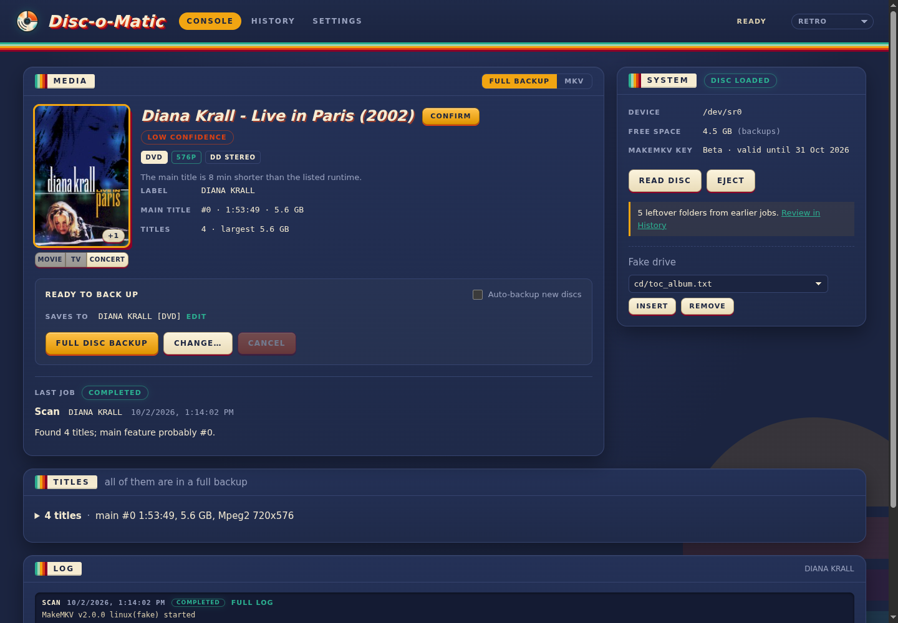
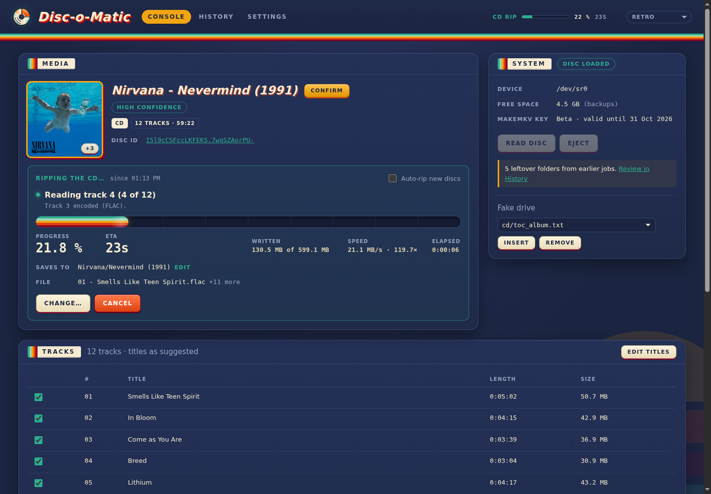

# Disc-o-Matic

A disc-ripping appliance with a web UI, made for Unraid and happy on any Docker host.
Put a disc in: it is read, recognised, and (if you like) backed up or ripped by itself
after a short countdown. Blu-ray, UHD, DVD and HD DVD go through MakeMKV; audio CDs through
cdparanoia, verified bit for bit; data discs are kept whole as ISO images. Nothing is ever
overwritten without asking.



**Install:** the Docker image is [`simplic17y/disc-o-matic`](https://hub.docker.com/r/simplic17y/disc-o-matic); releases and
their notes are [here](https://github.com/Disc-o-Matic/disc-o-matic/releases). Questions and bugs:
[issues](https://github.com/Disc-o-Matic/disc-o-matic/issues).

## What it does

**Video discs** (MakeMKV)
- Full decrypted backups (the disc's folder structure) or MKV rips of chosen titles; the
  main feature is picked for you.
- Recognised with TMDB (movies, TV season discs: your own free key) and MusicBrainz
  (concerts, no key), with posters to choose from.
- Plex/Jellyfin naming: `Movies/Alien (1979)/Alien (1979) - 2160p.mkv`, several versions
  of a film in one folder, TV episodes as `Show (Year)/Season 01/Show (Year) - S01E05 - Title.mkv`,
  concerts in their own folder. Templates for everything, a folder name can be typed by
  hand, even while the rip runs.
- UHD with a LibreDrive-capable drive; MakeMKV's beta key fetched and kept current.
- Rip MKVs later from a full backup, no disc needed: System → Open a backup… (or Open on a
  finished backup).
- Track profiles (Settings → Track profiles): which audio and subtitle languages a rip keeps,
  stereo twins and HD cores left out, LPCM saved as FLAC; picked per rip in the Titles panel,
  where the languages can still be changed, and passed to MakeMKV as a profile of its own.

**Audio CDs** (cdparanoia)
- Secure reading with the drive's read offset corrected; every track checked against
  **AccurateRip** and **CTDB**, with a diagnosis when it doesn't match (another pressing,
  read errors, a wrong offset).
- Fast: a disc the databases know is read at full speed first, and only the tracks they
  don't confirm are read again carefully; once the last track is read the drive is free
  (ejected, if you like) while encoding, checks and tagging finish in the background.
- MusicBrainz disc ID (CD-TEXT and CD stubs when it has nothing), every tag Picard would
  write, ReplayGain, cover art (Cover Art Archive, Deezer, iTunes, your pick), a playlist.
- FLAC, MP3 or Opus; albums of several discs in one folder; hidden tracks before track 1;
  "[silence]" filler tracks left out; an optional whole-disc FLAC + cue image.
- Scratched discs: retries per sector and per track, and a failed rip resumes where it
  stopped.



**Data discs**: copied sector by sector with ddrescue to `ISO/<label>.iso`, unreadable
spots retried and reported.

**Burning**: put a blank CD-R in and pick an album from the music folder: its tracks are
turned into CD audio (FLAC, MP3, Opus; resampled when need be) and burnt disc-at-once with
cdrdao, with CD-TEXT so players show the artist and titles.

**Metadata kept with the files**: each backup or rip gets a `disc.json` (the disc as read and
its match), Kodi/Jellyfin NFO files (movie, TV show and episodes, album) and the poster and
backdrop, so it describes itself without DOM's database and media servers take the match as
confirmed. Your own NFO or poster files are never overwritten (Settings → Defaults to switch off).

**Several drives**: every optical drive the container has gets its own section, working at
the same time (a CD rip in one, a Blu-ray backup in the other); each with its own name, read
offset (AccurateRip's for its model suggested), Aut-o-matic switch and Blu-ray / DVD mode
(Settings → Drives). An opened backup is a section of its own too: ripping MKVs from it never
waits for a drive, nor holds one up.

**Around it**: an automatic job after each disc is read (with a countdown you can stop),
discs done before left alone, live progress, a history with every log, verify a CD again
later, delete a rip with its files, desktop notifications and a chime, themes.

## Install

**Unraid**: in Community Applications search for *Disc-o-Matic*, or add the template by hand:
Docker → Add Container → Template → paste
`https://raw.githubusercontent.com/Disc-o-Matic/disc-o-matic/main/disc-o-matic.xml`. Pass the optical
drive as two devices: its block device (`/dev/sr0`) and its SCSI generic device (`/dev/sgN`;
`ls -l /sys/class/scsi_generic/*/device/block` shows which N belongs to which drive). Apply
and open port 8088. Each further drive: its two devices too.

**Any Docker host**: [compose.example.yaml](compose.example.yaml), or

```sh
docker run -d --name disc-o-matic -p 8088:8088 \
  --device /dev/sr0 --device /dev/sg2 \
  -v ./config:/config -v /srv/media/Backups:/backups \
  -e PUID=1000 -e PGID=1000 simplic17y/disc-o-matic:latest
```

The image bundles [MakeMKV](https://www.makemkv.com/), unmodified, under its own
[EULA](https://www.makemkv.com/eula/): pulling and running the image means accepting it. It is
free during its beta and needs no key setup here (`MAKEMKV_KEY=BETA`). MakeMKV bypasses copy
protection: make sure that is legal where you live.

On first start the console shows a **setup checklist**: each drive and its control device,
LibreDrive, the MakeMKV key, every output folder, the optional TMDB key, each with what to
do when it isn't right.

## Configure

Almost everything is in **Settings**, applied immediately and kept in the database:
notifications, what happens to a disc (mode, automatic job and its delay, existing
output), naming templates with live previews, the output folders (Settings → Storage),
movie recognition, music (format, verification, read offset, cover sources, …), the
MakeMKV key and read retries.

Container variables:

| Variable | Default | |
|---|---|---|
| `PUID` / `PGID` | `99` / `100` | who the app runs as and owns new files (Unraid's nobody:users) |
| `UMASK` | `000` | permissions of new files (000: anyone on the share may change them) |
| `MAKEMKV_KEY` | `BETA` | the free beta key, kept current; or your registration key |
| `MAKEMKV_UPDATE_CHECK` | `1` | MakeMKV's own online check (keeps its key data current) |

Settings can also come from `/config/dom.yaml` (see the example in the source) or
`DOM_<SECTION>__<KEY>` variables, e.g. `DOM_CD__FORMAT=opus`; Settings in the UI win.

Default folders, all under `/backups` until you move them:

| Disc | Folder |
|---|---|
| Full backups (Blu-ray, UHD) | `Bluray/<Title (Year)> [<media>]/` (its BDMV folder) |
| Full backups (DVD) | `DVD/<Title (Year)> [DVD]/<Title (Year)> [DVD].iso` (MakeMKV saves a DVD as an image) |
| Movies (MKV) | `MKV/<Title (Year)>/` |
| TV, concerts | `TV/…`, `Concerts/…` |
| Audio CDs | `Music/<Artist>/<Album (Year)>/01 - Title.flac` |
| CD images | `CD Images/<Artist>/<Album (Year)>/` |
| Data discs | `ISO/<label>.iso` |

## Troubleshooting

See [troubleshooting.md](troubleshooting.md): the drive not found, MakeMKV not seeing it,
"volume key unknown", UHD, permissions, `move_failed`, CD verification results and
scratched discs.

## Credits

- [MakeMKV](https://www.makemkv.com/) (bundled, under its own EULA), cdparanoia, FLAC, LAME,
  opus-tools, rsgain, GNU ddrescue, libdiscid, libcdio.
- Metadata: [MusicBrainz](https://musicbrainz.org/) and the
  [Cover Art Archive](https://coverartarchive.org/) (no key), [TMDB](https://www.themoviedb.org/)
  (your own free key; this product uses the TMDB API but is not endorsed or certified by
  TMDB), Deezer and iTunes covers when the archive has none.
- Verification: [AccurateRip](http://www.accuraterip.com/) and
  [CTDB](http://db.cuetools.net/) (CUETools).
